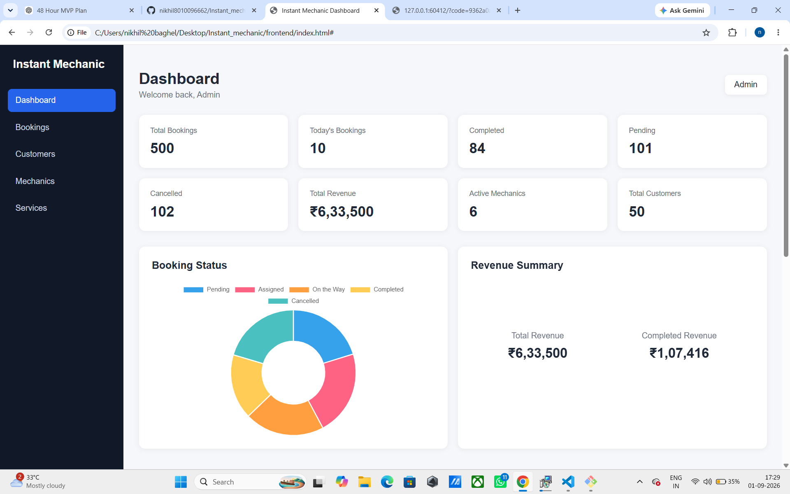

# Instant Mechanic — Live Dashboard

A full-stack mechanic service management dashboard built using **Java Spring Boot, MySQL, HTML, CSS and JavaScript**.

The application provides a centralized dashboard for managing bookings, customers, mechanics and services.

## Features

## Dashboard Preview



### Dashboard

* Total bookings
* Today's bookings
* Completed bookings
* Pending bookings
* Cancelled bookings
* Total revenue
* Active mechanics
* Total customers
* Booking status chart
* Revenue summary
* Recent bookings
* Automatic data refresh

### Bookings

* View all bookings
* Search bookings by customer or vehicle
* Filter bookings by status
* Update booking status
* View booking amount and date
* Booking status is persisted in MySQL

### Customers

* View registered customers
* Search customers

### Mechanics

* View mechanics
* Search mechanics
* Filter mechanics by availability/status
* View completed jobs

### Services

* View available services
* Search services
* Filter services by category
* Display service prices

## Technology Stack

### Frontend

* HTML5
* CSS3
* JavaScript
* Chart.js

### Backend

* Java
* Spring Boot
* Spring Data JPA
* REST API
* Maven

### Database

* MySQL

## Project Structure

```text
Instant_mechanic/
│
├── frontend/
│   ├── index.html
│   ├── script.js
│   └── style.css
│
├── backend/
│   ├── src/
│   │   └── main/
│   │       ├── java/
│   │       └── resources/
│   ├── pom.xml
│   └── database.sql
│
├── README.md
└── .gitignore
```

## Backend API

### Bookings

```text
GET    /api/bookings
GET    /api/bookings/{id}
POST   /api/bookings
PUT    /api/bookings/{id}
DELETE /api/bookings/{id}
PUT    /api/bookings/{id}/status
```

### Customers

```text
GET /api/customers
```

### Mechanics

```text
GET /api/mechanics
```

### Services

```text
GET /api/services
```

## Booking Status

The dashboard supports the following booking statuses:

```text
PENDING
ASSIGNED
MECHANIC_ON_THE_WAY
COMPLETED
CANCELLED
```

## Running the Backend

Open PowerShell/Terminal inside the backend folder:

```powershell
.\mvnw.cmd spring-boot:run
```

The Spring Boot backend runs on:

```text
http://localhost:8080
```

Make sure MySQL is running before starting the backend.

## Running the Frontend

Open a terminal inside the frontend folder:

```powershell
npx serve .
```

Then open the local URL displayed by the terminal.

The frontend communicates with the Spring Boot backend running on port `8080`.

## Database

The application uses **MySQL** with **Spring Data JPA**.

Database configuration is available in:

```text
backend/src/main/resources/application.properties
```

A SQL database file is also included in the backend folder for database setup/reference.

## Live Dashboard

The dashboard automatically refreshes its data periodically.

This allows updated booking information and dashboard statistics to appear without requiring a manual browser refresh.

## Search and Filtering

The application provides search and filtering functionality for:

* Bookings
* Customers
* Mechanics
* Services

## CORS

The Spring Boot backend is configured to allow requests from the frontend application.

## Error Handling

The frontend displays appropriate error messages when API requests fail or the backend is unavailable.

## Author

**Instant Mechanic — Full Stack Developer Intern Assessment Project**
